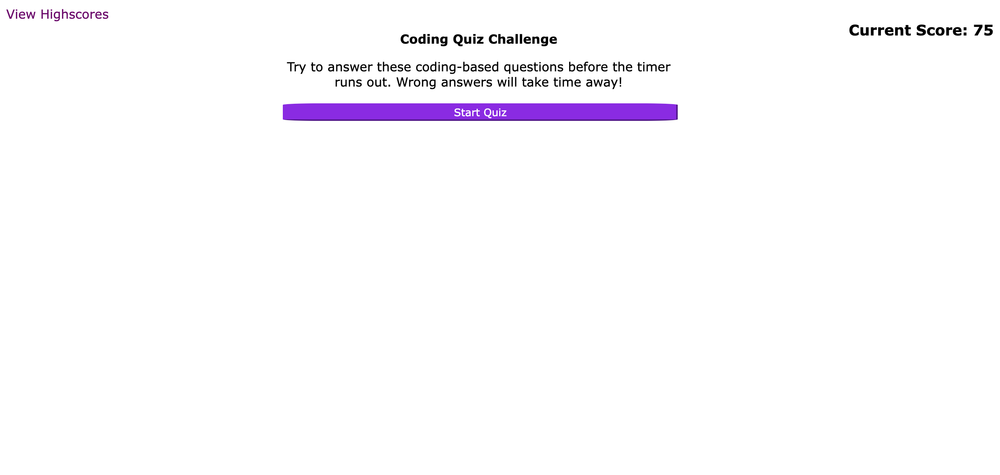

# Quiz with Timer

## Description

This is a small quiz of coding concepts. This project was focused on the introduction of web APIs.

- I learned that JavaScript has a lot of capability beyond coding.
- Coding takes some creativity and thinking 'outside the box.'

## Installation

N/A

## Usage

This does have some basic coding questions with a timer to count-down the score. Opening the

Here is a link: https://rtcottle.github.io/quiz-with-timer/

## Credits

README help: https://coding-boot-camp.github.io/full-stack/github/professional-readme-guide

Event-listener help: https://www.youtube.com/watch?v=XF1_MlZ5l6M&t=23s

Storage help: https://www.youtube.com/watch?v=GihQAC1I39Q

## License

Licensed under the ! [MIT] license. (https://img.shields.io/badge/License-MIT-yellow.svg)(LICENSE)

## Features

If your project has a lot of features, list them here.

## Tests

See how fast you can answer the questions correctly!
